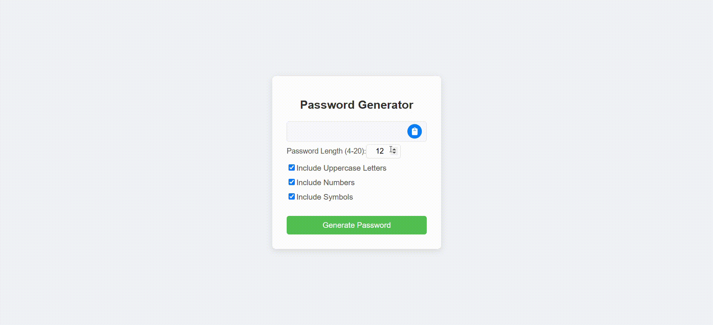

# Password Generator App 🔒

Welcome to the **Password Generator App**! This React application is designed to help you create strong, secure passwords with ease. Whether you need a password for your new account or want to update your existing passwords, this app has got you covered!

## Features ✨

- **Customizable Password Length**: Generate passwords of varying lengths (18, 19, 20, etc.) to meet your security requirements.
- **Character Variety**: Choose from uppercase letters, lowercase letters, numbers, and special characters to create the perfect password.
- **User-Friendly Interface**: A clean and intuitive design makes password generation a breeze!
- **Copy to Clipboard**: Easily copy your generated password with a single click.

## Demo 🎥

Check out the live app here: [Password Generator App on GitHub Pages](https://deepakpatil26.github.io/react_calculator)



## Installation 🚀

- To run this app locally, follow these steps:

1. Clone the repository:

```bash
   git clone https://github.com/deepakpatil26/react_calculator.git
```

2. Navigate to the project directory:

```bash
   cd react_calculator
```

3. Install dependencies:

```bash
   npm install
```

4. Start the application:

```bash
   npm start
```

Usage 💻

1. Open the app in your browser.
2. Select the desired password length and character types.
3. Click the Generate Password button to create a strong password.
4. Click the Copy button to save your new password to the clipboard.

Technologies Used 🛠️

- React: A JavaScript library for building user interfaces.
- CSS: For styling the application.

Contributing 🤝
Contributions are welcome! Feel free to submit a pull request or open an issue if you find a bug or have a feature request.

License 📄
This project is licensed under the MIT License - see the LICENSE file for details.

Acknowledgements 🙏

- Inspired by the need for strong password security.
- Thanks to the React community for their incredible support and resources!
